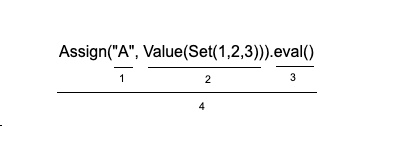
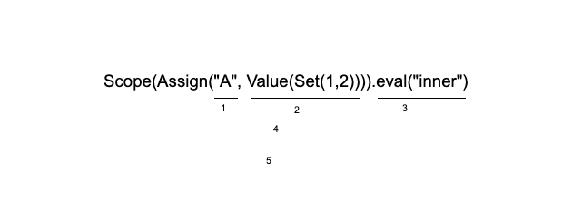
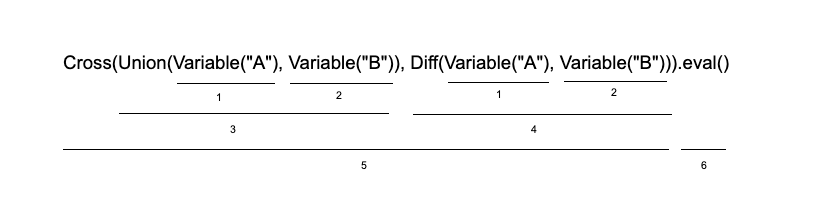

# CS 474 : HW1 by Rishabh Goel

**Scaset** is a DSL(Domain Specific Language) developed for people who study Set Theory. This language will help people to run various set operations. 

Operations included:

| OPERATION | DESCRIPTION |
| :-------------: |:-------------:|
| `Value(2).eval()`      | Get the value of the item passed |
| `Variable("A").eval()`      | Get the value of a variable |
| `Assign("A", Value(Set(1,2,3))).eval()` | Assign value to a set |
| `Insert(Variable("A"), Value(4)).eval()` | Insert in a set |
| `Delete(Variable("A"), Value(2)).eval()` | Delete from a set |
| `Check(Variable("A"), Value(3)).eval()` | Check element in a set |
| `Union(Variable("A"), Variable("B")).eval()` | Union of 2 sets |
| `Intersection(Variable("A"), Variable("B")).eval()` | Intersection of 2 sets |
| `Diff(Variable("A"), Variable("B")).eval()` | Symmetric Difference of 2 sets |
| `Cross(Variable("A"), Variable("B")).eval()` | Cartesian Product of 2 sets |
| `SetMacro("delete", Delete(Variable("A"), Value(1))).eval()` | Initialize a Macro |
| `GetMacro("delete").eval()` | Fetch a Macro by name |
| `Scope(Union(Variable("A"), Variable("B"))).eval("inner")` | Compute result in a named scope |
| `Scope(Union(Variable("A"), Variable("B"))).eval("")` | Compute result in an anonymous scope |
| `Scope(Union(Variable("A"), Variable("B"))).eval()` | Compute result in default scope |

## <u>Instructions to Execute</u>

### <u>Testcases</u>
#### Using IntelliJ
1. Clone the repository from Github
2. Open the project using IntelliJ.
3. Run the testcases to see the result.

#### Using Command Line
1. Navigate to the project folder
2. Run the test cases using the command - `sbt clean compile test`

### <u>User execution</u>
#### Using IntelliJ

Import the following dependencies into your code:
   1. `import scala.collection.mutable.Set`
   2. `import scala.collection.mutable.Map`
   3. `import com.rishabh.hw1.Computation.SetExp.*`

Note: If trying to perform some operation using a variable that has not been assigned, it will result in an error.

## <u>Files Used</u>

* **Computation**: Create DSL for Set Operations
* **ComputationTest**: Test DSL for Set Operations

## <u>Code Structure</u>

1. Variable name
2. Value to be assigned with the variable name
3. Entry point to the function with default scope
4. Assigns Set(1,2) to the variable A i.e A -> Set(1,2) in default scope

---

1. Variable name
2. Value to be assigned with the variable name
3. Entry point to the function with scope_name = inner
4. Assigns Set(1,2) to the variable A i.e A -> Set(1,2)
5. Sets a scope variable A with value Set(1,2)

---

1. Fetch the value of variable A assigned using syntax from image 1
2. Fetch the value of variable B assigned using syntax from image 2
3. Perform Union of sets A and B
4. Perform Symmetric Difference of sets A and B
5. Cartesian product of the sets obtained as result of step 3 and 4
6. Sets the result in default scope

## <u>Future Enhancements</u>

1. Implement code for nested scope
2. Implement a cleaner code

