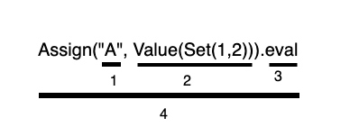
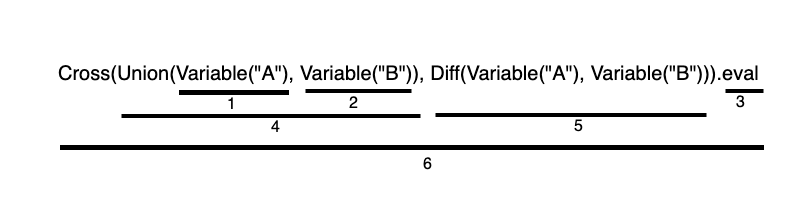

# CS 474 : HW1 by Rishabh Goel

**Scaset** is a DSL(Domain Specific Language) developed for people who study Set Theory. This language will help people to run various set operations. 

Operations included:

| OPERATION | DESCRIPTION |
| :-------------: |:-------------:|
| `Value(2)`      | Get the value of the item passed |
| `Variable("A")`      | Get the value of a variable |
| `Create("A", Value(Set(1,2,3)))` | Create a set |
| `Insert(Variable("A"), Value(4))` | Insert in a set |
| `Delete(Variable("A"), Value(2))` | Delete from a set |
| `Check(Variable("A"), Value(3))` | Check element in a set |
| `Union(Variable("A"), Variable("B"))` | Union of 2 sets |
| `Intersection(Variable("A"), Variable("B"))` | Intersection of 2 sets |
| `Diff(Variable("A"), Variable("B"))` | Symmetric Difference of 2 sets |
| `Cross(Variable("A"), Variable("B"))` | Cartesian Product of 2 sets |
| `SetMacro("delete", Delete(Variable("A"), Value(1)))` | Initialize a Macro |
| `GetMacro("delete")` | Fetch a Macro by name |
| `SetNamedScope("inner", Union(Variable("A"), Variable("B")))` | Initialize a named scope |
| `GetNamedScope("inner")` | Fetch a named scope |
| `SetAnonScope(Union(Value(Set(5)), Value(Set(10))))` | Initialize an anonymous scope |

## <u>Instructions to Execute</u>

### <u>Testcases</u>
#### Using IntelliJ
1. Clone the repository from Github
2. Open the project using IntelliJ.
3. Run the testcases to see the result.

#### Using Command Line
1. Navigate to the folder OOPSAssignment1/
2. Run the test cases using the command - `sbt clean compile test`

### <u>User execution</u>
#### Using IntelliJ

1. Import the following dependencies into your code:
   1. `import scala.collection.mutable.Set`
   2. `import scala.collection.mutable.Map`
   3. `import SetExp.*`

## <u>Files Used</u>

* **Computation**: Create DSL for Set Operations
* **ComputationTest**: Test DSL for Set Operations

## <u>Code Structure</u>

1. Variable name
2. Value to be assigned with the variable name
3. Entry point to the function
4. Assigns Set(1,2) to the variable A i.e A -> Set(1,2)

---

1. Fetch the value of variable A assigned using syntax from above image
2. Fetch the value of variable B assigned using syntax from above image
3. Entry point to the function
4. Perform Union of sets A and B
5. Perform Symmetric Difference of sets A and B
6. Cartesian product of the sets obtained as result of step 4 and 5